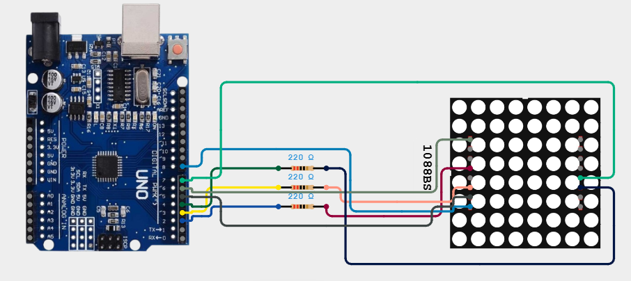
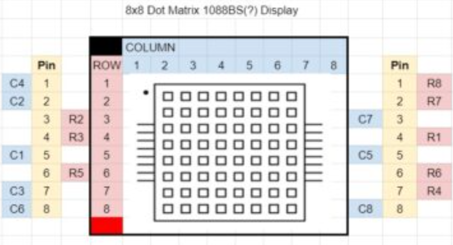

# Smile Detector

This is a DIY smile detector built with C++ and Python.

## Getting Started

### Dependencies

Before running this project, make sure that the following is installed:
* Arduino IDE/CLI
* Drivers for your specific Arduino board
* [OpenCv](https://pypi.org/project/opencv-python/)
* [PySerial](https://pypi.org/project/pyserial/)

If uv is installed on your device, run this command after pulling the repository:
```
uv sync
```

### Components

* Arduino board
* 1088BS 8 × 8 leds matrix
* 3 × 220Ω resistors

### Circuit diagram

Refer to the wiring setup before powering the board:





| Arduino Pin | Resistor | Matrix Pin | Function |
| :--- | :--- | :--- | :--- |
| **Pin 8** | None | Pin 8 (Left) | Column 6 (C6) |
| **Pin 7** | None | Pin 5 (Right) | Column 5 (C5) |
| **Pin 6** | 220 Ω | Pin 1 (Left) | Row 4 (C4) |
| **Pin 5** | None | Pin 7 (Left) | Column 3 (C3) |
| **Pin 4** | 220 Ω | Pin 6 (Right) | Row 6 (R6) |
| **Pin 3** | 220 Ω | Pin 6 (Left) | Row 5 (R5) |
| **Pin 2** | None | Pin 4 (Left) | Row 3 (R3) |
